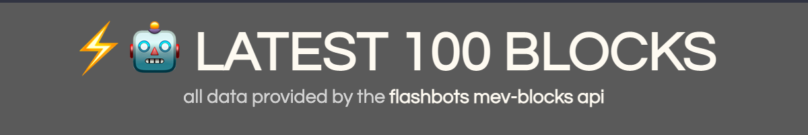

# 

A web application that utilizes the Flashbots mev-blocks api to visualize block and transaction data from the latest 100 Flashbots blocks.

* all data provided from  <a href='https://blocks.flashbots.net/'>here</a>


**Try it out here:** [FLASHBOARD](https://henreth.github.io/flashboard/)

### Developed By:

<a href="https://github.com/henreth" target="_blank" title="henreth">
  
</a>

# Demos:


#
## Technicals:

**Made With:** 

<a href="https://www.typescriptlang.org/" target="_blank" rel="noreferrer">  </a> 
<a href="https://reactjs.org/" target="_blank" rel="noreferrer">  </a> 


</p>

#
## How to Run This Application:
* Run the following commands in two seperate terminals:

```
// install and start the frontend interface
npm install --prefix client
npm start --prefix client 
```
